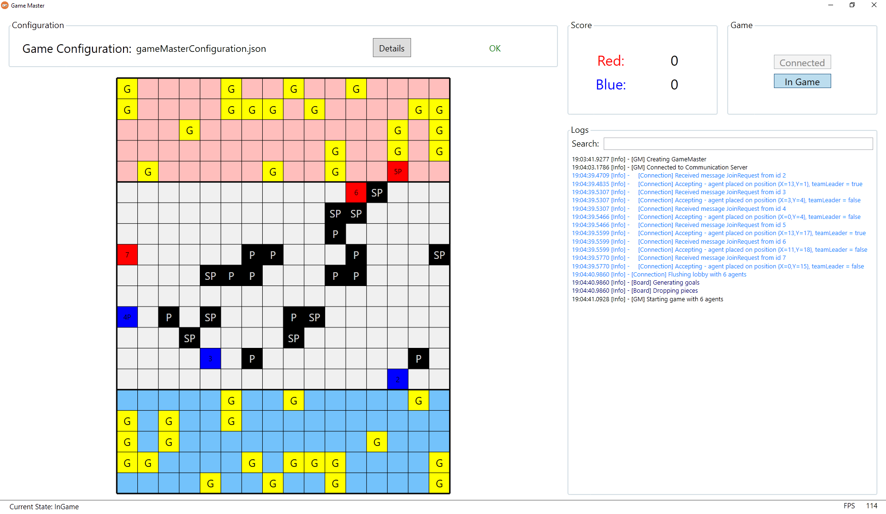

# README #

This is repository for Software Engineering MiNI course. The course featured creating a system cointaining 3 modules:
* Game Master - managing players and gameplay, presentation layer,
* Communication Server - passing messages between Game Master and Agents,
* Agent - autonomous player, capable of playing the game and cooperating with teammates.

## Methodology
We are working in Scrum. But our Scrum is more agile then expected.
Product Owner is the same person as Project Manager, Team Leader, Architect and Lead Developer is one person - [Mateusz](https://github.com/Sliwson) is the one.
I decided to be a Scrum Master - [Szymon](https://github.com/szymon159).
Apart from that, we are all developers responsible mostly for specific modules:

* Game Master - [Mateusz](https://github.com/Sliwson), [Michał](https://github.com/Rogal27)
* Agent - [Marta](https://github.com/martabanel c), [Weronika](https://github.com/werglu)
* Communication server - [Szymon](https://github.com/szymon159)
* Intermodule Communication - Everyone

## Schedule
As we are working in Scrum, we have sprints. They are week or two long:
#### Sprint 1 (11.03 - 24.03) - Game (development)
Working in teams as mentioned above, in order to create the best experience for future users. That means spending two free weeks on coding.

#### Sprint 2 (25.03 - 02.04) - Game (testing)
Apart from unit and integration tests, we need more tests. So whole week for testing and fixing bugs. And adding more tests.

#### Sprint 3 (03.04 - 21.04) - Communication (development)
Communication is not always as simple as expected. So we have to handle lots of exceptions, serialization, deserialization, connection problems and so and so forth.

#### Sprint 4 (22.04 - 05.05) - Communication (tests)
See Sprint 2 - more testing, this time for functionalities implemented in Sprint 3.

#### Sprint 5 (06.05 - 19.05) - Cooperation (development)
It is always nice to know what to do. We do, but our agents don't. So we will work on teaching them about some fancy, extremely complicated tactics, communication strategy, reacting to expected problems and tricking opponents.

#### Sprint 6 (20.05 - 26.05) - Cooperation (testing)
Time for our agents to prove that they now know what to do. Fixing, learning more tactics, fighting with themselves (and each other). If one agent loses his mind, rest of the team should keep working.

#### Sprint 7 (27.05 - 03.06) - Preparations for Championship
The time of the trial is coming. We have to make sure our agents are ready to face other teams (or at least move). Final bootcamp, more practice, probably friendly matches with other teams - everything to cover our team with glory on the finest Championship these year is about to give us.

## Technology stack
* Agent, Communication server - .NET Core 3.1 console applications (pipelines support and portability)
* Game Master - .NET Core 3.1 (for easier presentation layer integration) with presentation layer in WPF
* Communication - TCP Sockets
* Serialization - Newtonsoft
* Logging - NLog
* Tests - NUnit
* Mocks for tests - Moq
